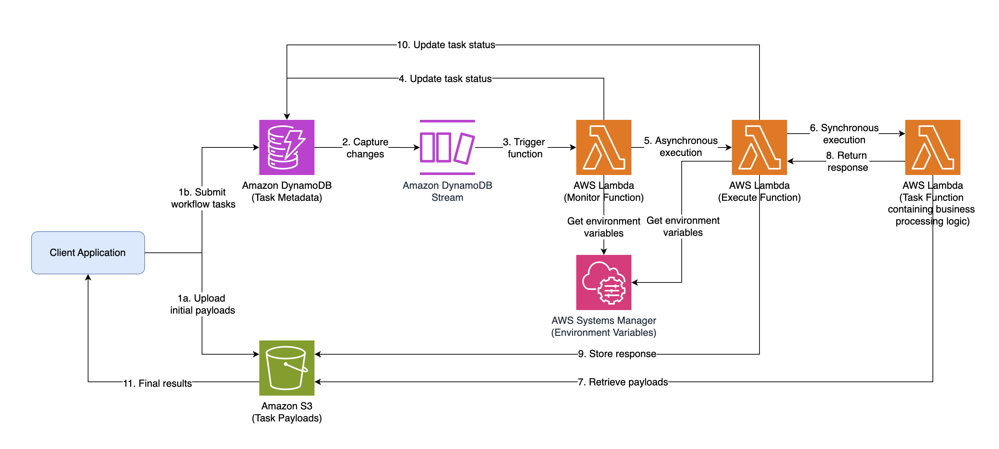
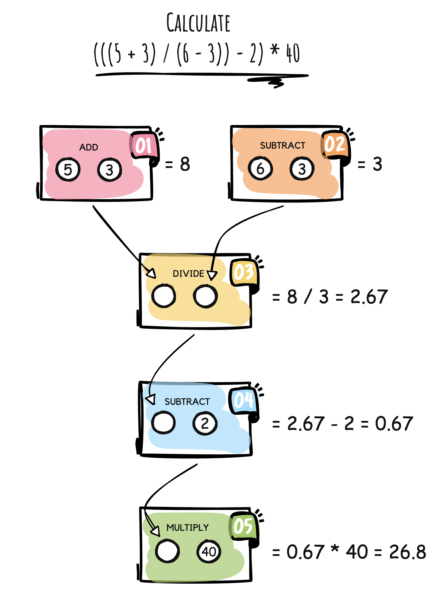
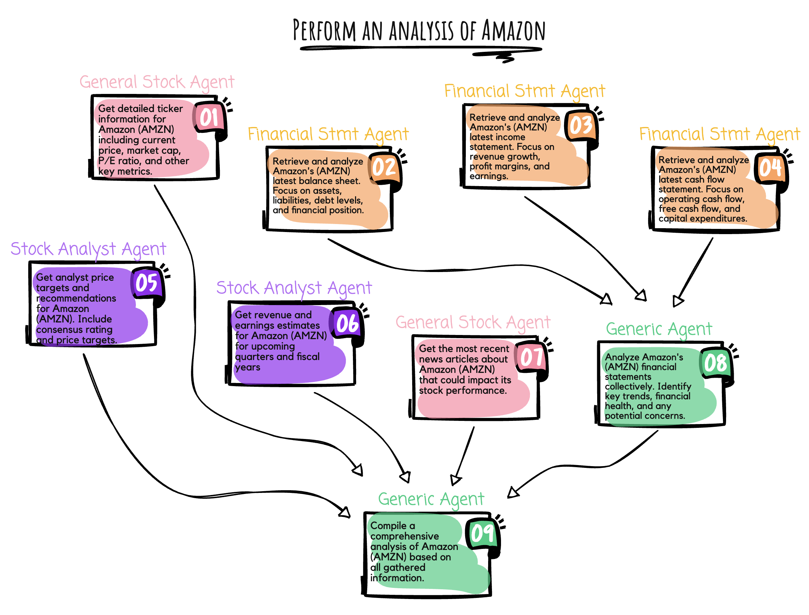

# On-Demand Workflow Orchestration Engine

A serverless, dynamic workflow orchestration engine built with Amazon DynamoDB and AWS Lambda that enables flexible, event-driven task execution with complex dependency patterns.

## Introduction

Modern applications, especially those leveraging AI capabilities, often require workflows that can adapt and change at runtime. While solutions like AWS Step Functions excel at orchestrating predefined workflows, some use cases demand more flexibility - where the sequence of tasks isn't known until execution time.

This solution enables you to:
- Create dynamic workflows that can be defined at runtime
- Implement flexible task dependencies using Amazon DynamoDB
- Handle parallel execution with fan-in and fan-out patterns
- Manage large payloads efficiently with Amazon S3
- Build resilient error handling and retry mechanisms

## Architecture



The architecture consists of these key components:
- **Client Application** - Submits workflow definitions with tasks and dependencies
- **DynamoDB Table** - Stores task definitions, status, and dependency information
- **DynamoDB Streams** - Captures changes to task items and triggers the Monitor function
- **Monitor Lambda Function** - Processes stream events and invokes Execute function when tasks are ready
- **Execute Lambda Function** - Invokes Task function and manages execution state/response updates and error handling
- **Task Lambda Function** - Performs task-specific work (math operations, AI agent execution, etc.)
- **S3 Bucket** - Stores task payloads and outputs
- **Lambda Layer** - Contains shared code for the orchestrator library

### Key Advantages

- **No Pre-defined Workflows**: Unlike AWS Step Functions/Apache Airflow, workflows are created dynamically at runtime
- **Arbitrary Dependencies**: Any task can depend on any number of other tasks, enabling complex patterns
- **Automatic Cleanup**: TTL-enabled DynamoDB items and S3 lifecycle policies ensure automatic resource cleanup
- **Cost Efficiency**: Pay only for the resources used during workflow execution
- **Scalability**: Handles any number of concurrent workflows without pre-provisioning

## Execution Flow

1.  Client application submits a workflow definition with tasks and their dependencies
    a)  Task payloads are uploaded to S3
    b)  Each task is stored in DynamoDB with `status=PENDING`
2.  Changes to DynamoDB are captured in DynamoDB Streams.
3.  The Monitor function is triggered, and it determines the readiness of the task by checking the status of its dependencies.
4.  If there are no dependencies or all dependencies have `status=COMPLETED`, the Monitor function updates DynamoDB with `locked=YES` to stop all other updates to this task.
5.  The Monitor function invokes the Execute function asynchronously.
6.  The Execute function receives the task details and invokes the appropriate Task function synchronously.
7.  The Task function receives the task details and converts it to the full-length payload by retrieving it from S3.
8.  The Task function processes the task and upon completion, returns its output as response back to the Execute function.
9.  The Execute function reviews the lambda execution response and automatically retries the execution if an error is detected. Otherwise, it stores the response in S3 for retrieval by dependent tasks.
10. The Execute function updates DynamoDB with `status=COMPLETED`, `locked=NO` and links the S3 payload location to each of its dependent tasks in DynamoDB.
11. The process (steps 2 to 10) iterates until all tasks reach a terminal state (`COMPLETED` or `ERROR`) and the results are retrieved by the client application.


## Example Workflows

### Mathematical Workflow

A simple mathematical workflow that calculates `(((5 + 3) / (6 - 3)) - 2) * 40` using a series of tasks with dependencies.



### AI Agent Workflow

A financial research agent that performs complex analysis on stocks by:
1. Taking a natural language query from a user
2. Dynamically creating a workflow based on the query
3. Executing specialized sub-agents in parallel to gather different types of data
4. Combining the results to provide a comprehensive analysis



## Deployment

### Prerequisites

1. [AWS CLI](https://aws.amazon.com/cli/) installed and configured with appropriate permissions
2. [AWS CDK](https://aws.amazon.com/cdk/) installed (`npm install -g aws-cdk`)
3. Bootstrapped your AWS environment for CDK deployments (`cdk bootstrap`)
4. Python 3.13 or later installed
5. Docker installed and running (for building Lambda container images)
6. [Enabled access to Amazon Bedrock models](https://docs.aws.amazon.com/bedrock/latest/userguide/model-access.html) in your AWS account (for AI agent example which requires cross-region inference)
   - Models: 
      - Claude Sonnet 3.7
      - Claude Haiku 3.5
      - Nova Premier
      - Nova Pro
   - Regions:
      - us-east-1
      - us-east-2
      - us-west-2
7. IAM permissions for running test commands:
   - `ssm:GetParameter` - For retrieving configuration values
   - `dynamodb:PutItem`, `dynamodb:Query`, `dynamodb:GetItem` - For workflow task management
   - `s3:PutObject`, `s3:GetObject` - For storing and retrieving task payloads and outputs
   - `bedrock:InvokeModelWithResponseStream` - For invoking workflow agent locally to generate & submit workflow definition

### Setup and Deployment

1. Create a virtual environment:
   ```
   python -m venv .venv
   source .venv/bin/activate  # On Windows: .venv\Scripts\activate
   ```

2. Install dependencies:
   ```
   pip install -r requirements.txt
   ```

3. Deploy the stack:
   ```
   ./deploy.sh
   ```

### Testing the Deployment

After deployment, you can test the solution with the included examples:

1. Run the mathematical workflow example:
   ```
   python test_workflow.py ExecuteMathFunction
   ```

2. Run the AI agent workflow example:
   ```
   python test_workflow.py ExecuteAgentFunction
   ```

### Clean Up

When you're done experimenting with the solution, remove all resources by running:
```
./destroy.sh
```


## Security

See [CONTRIBUTING](CONTRIBUTING.md#security-issue-notifications) for more information.

## License

This library is licensed under the MIT-0 License. See the LICENSE file.

